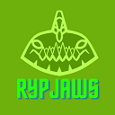
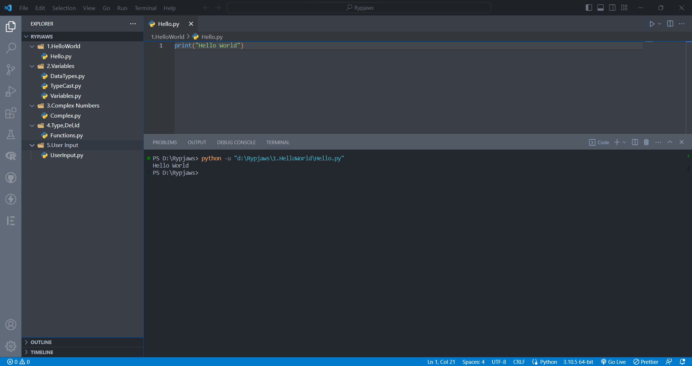

# Rypjaws VS Code Theme Extension

   
  Rypjaws

Welcome to the Rypjaws VS Code Theme Extension! This extension brings the Rypjaws theme to your Visual Studio Code editor, providing a stylish and immersive coding experience.

  
   
  Working

## Features

- **Elegant Color Scheme:** Rypjaws theme offers a carefully chosen set of colors that are easy on the eyes and enhance your focus on the code.
- **Syntax Highlighting:** The theme provides syntax highlighting for various programming languages, making your code stand out and improving readability.
- **Consistent Design:** Rypjaws maintains a consistent design across different elements of the editor, ensuring a cohesive and visually pleasing experience.
- **Customized UI Components:** The extension modifies the appearance of various UI components, including the sidebar, activity bar, status bar, and more, to match the overall aesthetic of the theme.
- **Optimized for Productivity:** Rypjaws is designed to help you stay productive with its carefully selected colors and contrast ratios, allowing you to work for long hours without straining your eyes.

## Installation

1. Launch Visual Studio Code.
2. Open the Extensions view by clicking on the square icon in the left sidebar or by pressing `Ctrl+Shift+X` (`Cmd+Shift+X` on macOS).
3. Search for "Rypjaws" in the Extensions Marketplace.
4. Click on the "Install" button for the Rypjaws VS Code Theme Extension.
5. Once installed, click on the "Reload" button to activate the theme.

## Activation

To activate the Rypjaws theme, follow these steps:

1. Open the Command Palette by pressing `Ctrl+Shift+P` (`Cmd+Shift+P` on macOS).
2. Type "Preferences: Color Theme" and select it from the list.
3. Scroll through the available themes and choose "Rypjaws" from the options.
4. The Rypjaws theme will be applied immediately.

## Website 
Please do visit our website for more information at [Rypjaws](https://rypjaws.netlify.app/)
Docker Repository [Docker](https://hub.docker.com/r/mihir5400/rypjaws-extension)

## Feedback and Contributions

Feedback and contributions are always welcome! If you encounter any issues, have suggestions for improvements, or would like to contribute to the project, please visit the [GitHub repository](https://github.com/MihirRajeshPanchal/rypjaws) for the Rypjaws VS Code Theme Extension.

## License

This extension is released under the [MIT License](LICENSE).

## Credits

The Rypjaws theme was created by [Mihir Panchal](https://github.com/MihirRajeshPanchal). Special thanks to the following contributors for their valuable input and support.

Thank you for choosing the Rypjaws VS Code Theme Extension! We hope you enjoy coding with this stylish and immersive theme. If you find it useful, please consider sharing it with your friends and colleagues. Happy coding!
